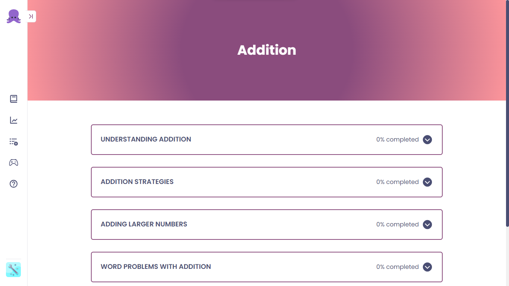

# Octo - AI Tutor



## Overview

This repo is for our google AI hackathon It uses Google's [Gemini](https://gemini.google.com/app) API to genrate personalized lessons for the user based on details provided.

## Table of contents

- [The challenge](#the-challenge)
- [Links](#links)
- [Built with](#built-with)
- [How to use](#how-to-use)
- [Continued development](#continued-development)
- [Contributors](#contributors)

### The challenge

A common challenge faced by students is the inability to understand the concept being taught in class. This app aims to solve that by providing personalized lessons for the user based on their details.

### Links

- [Octo](https://github.com/kolosafo/gemina)

### Built with

- [Next.js](https://nextjs.org/docs)
- [Typescript](https://www.typescriptlang.org/docs/)
- [TailwindCSS](https://tailwindcss.com/docs)
- [Gemini](https://gemini.google.com/app)

### Continued development

- Add interactive learning games.

### How to Use

Clone this repository or download to your local machine

```bash
  git clone
```

Go to the project directory

```bash
  cd gemina
```

Install dependencies

```bash
  npm install
```

Start the server

```bash
  npm run dev
```

Open [http://localhost:3000](http://localhost:3000) with your browser to see the result.

## Contributors

- [Dauda](https://github.com/kolosafo)
- [Taqib](https://github.com/taqrah)
- [Ibrahim](https://github.com/taqrah)
